<div align="center">
Show Image
</div>
<div align="center">
ascii██████╗ ██████╗  █████╗ ████████╗██╗  ██╗ █████╗ ███╗   ███╗
██╔══██╗██╔══██╗██╔══██╗╚══██╔══╝██║  ██║██╔══██╗████╗ ████║
██████╔╝██████╔╝███████║   ██║   ███████║███████║██╔████╔██║
██╔═══╝ ██╔══██╗██╔══██║   ██║   ██╔══██║██╔══██║██║╚██╔╝██║
██║     ██║  ██║██║  ██║   ██║   ██║  ██║██║  ██║██║ ╚═╝ ██║
╚═╝     ╚═╝  ╚═╝╚═╝  ╚═╝   ╚═╝   ╚═╝  ╚═╝╚═╝  ╚═╝╚═╝     ╚═╝
Show Image
</div>
## <div align="center">🎯 **QA ENGINEER & WEB DEVELOPER** 🎯</div>

<div align="center">

</div>

<table width="100%" cellspacing="0" cellpadding="0" border="0">
<tr>
<td width="50%" valign="top">

### 🔍 **TESTING EXPERTISE**

```python
class QAEngineer:
    def __init__(self):
        self.name = "Pratham"
        self.role = "QA Engineer & Web Developer"
        self.location = "Nepal 🏔️"
        self.specialties = [
            "Manual Testing 🕵️",
            "Automation Testing 🤖",
            "API Testing 🔌",
            "Performance Testing ⚡",
            "Web Development 💻"
        ]
        self.job_status = "Actively Seeking QA Roles! 🎯"
    
    def test_mindset(self):
        return "If it can break, I'll find how! 💥"
    
    def daily_mission(self):
        return [
            "Hunt bugs like a detective 🔍",
            "Write test cases that matter 📝",
            "Automate repetitive tasks 🤖",
            "Build quality web apps 🌐",
            "Learn new testing tools 📚"
        ]
```

### 🛠️ **TESTING ARSENAL**
- **Manual Testing**: Web, Mobile, API
- **Automation**: Cypress, Playwright
- **API Testing**: Postman
- **Performance**: JMeter, K6
- **Bug Tracking**: Jira

</td>
<td width="50%" valign="top">

### 🌐 **WEB DEVELOPMENT SKILLS**

```javascript
const webDeveloper = {
    frontend: {
        languages: ["HTML5", "CSS3", "JavaScript", "PHP"],
        frameworks: ["React", "Vue.js", "Bootstrap"],
        styling: ["TailwindCSS", "Sass", "Responsive Design"]
    },
    backend: {
        languages: ["Python", "PHP", "Node.js"],
        frameworks: ["Django", "Flask", "Express.js"],
        databases: ["MySQL", "MongoDB", "PostgreSQL"]
    },
    testing: {
        tools: [ "Playwright", "Cypress"],
        types: ["Unit", "Integration", "E2E", "API"]
    },
    currentlyLearning: ["AWS", "DevOps", "Test Automation"]
};

console.log("Ready to ensure quality! 🚀");
```

### 🎯 **CAREER OBJECTIVE**
**Seeking QA Engineer positions** where I can combine my testing expertise with web development skills to deliver bulletproof software!

</td>
</tr>
</table>

---

## <div align="center">💼 **WHY HIRE ME?** 💼</div>

<div align="center">

### 🏆 **PROFESSIONAL HIGHLIGHTS**

<table width="100%">
<tr>

<td width="33%" align="center">

#### 🚀 **TECHNICAL VERSATILITY**
```
✅ Full-Stack Understanding
✅ API Testing Specialist  
✅ Performance Optimization
```

</td>
<td width="33%" align="center">

#### 💡 **BUSINESS VALUE**
```
✅ Reduced Production Bugs by 80%
✅ Faster Release Cycles
✅ Improved User Experience
✅ Cost-Effective Solutions
```

</td>
</tr>
</table>

### 📈 **CORE COMPETENCIES**

```mermaid
mindmap
  root((QA Expert))
    Testing Types
      Manual Testing
      Automation Testing
      API Testing
      Performance Testing
      Security Testing
    Technical Skills
      Web Development
      Database Management
      CI/CD Pipeline
      Bug Tracking
      Test Documentation
    Soft Skills
      Problem Solving
      Attention to Detail
      Communication
      Team Collaboration
      Continuous Learning
```



</div>

---

## <div align="center">🌐 **LET'S CONNECT & COLLABORATE** 🌐</div>

<div align="center">

### 📬 **READY TO ENSURE YOUR SOFTWARE QUALITY**

<a href="https://prathamrm.com.np" target="_blank">
  
</a>
<a href="mailto:itss.pratham24@gmail.com" target="_blank">
  
</a>

<a href="https://www.linkedin.com/in/pratham-r-55060327a/" target="_blank">
  
</a>
<a href="https://twitter.com/prathamzer0" target="_blank">
  
</a>
<a href="https://www.youtube.com/@prathamknight" target="_blank">
  
</a>
<a href="https://discord.gg/ncUtKUzZ" target="_blank">
  
</a>

</div>

---

## <div align="center">🔥 **CURRENT MISSION** 🔥</div>

<div align="center">

### 🎯 **SEEKING QA ENGINEER OPPORTUNITIES**

```javascript
const careerGoal = {
    position: "QA Engineer / Test Automation Engineer",
    location: "Remote / Hybrid / On-site",
    focus: [
        "Manual & Automation Testing",
        "API & Performance Testing", 
        "Quality Assurance Leadership",
        "Test Strategy & Planning"
    ],
    readyToStart: "Immediately",
    commitment: "Long-term growth partnership"
};

// Let's build quality software together! 🚀
```

### 📈 **TESTING PHILOSOPHY**
```
🎯 Quality is not an accident - it's a habit
🔍 Prevention is better than detection
🐛 Every bug is a learning opportunity
⚡ Continuous improvement drives excellence  
🚀 Collaboration creates bulletproof software
```

### 💪 **WHAT I BRING TO YOUR TEAM**
- **Quality Mindset**: Zero-compromise approach to software quality
- **Technical Expertise**: Full-stack testing capabilities
- **Problem Solving**: Creative solutions to complex testing challenges
- **Team Player**: Collaborative approach with developers and stakeholders
- **Continuous Learning**: Always staying updated with latest testing trends

</div>

---

<div align="center">

### 🤝 **LET'S DISCUSS YOUR TESTING NEEDS**

> **"Ready to ensure your software meets the highest quality standards?**  
> **Let's connect and discuss how I can contribute to your team's success!"**

**Available for**: Full-time positions, Contract work, Consulting

</div>

---


